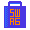

# ¡Bienvenidos al Hacktoberfest CaribeDev.org! 🎉

¡Estamos participando en Hacktoberfest 2025! 🎃🍻✨ Contribuye a nuestro proyecto opensource y ayuda a visibilizar las comunidades tech del Caribe 🌴🇨🇴

### Pasos para Crear tus primeros PR y obtener merch gratis.

Paso 0: Crea una cuenta de Github gratis [aquí](https://github.com/signup?ref_cta=Sign+up&ref_loc=header+logged+out&ref_page=%2F&source=header-home).

Paso 1: Registrate en Hactoberfest-2025 usando tu id de github.

Paso 2: Marca como estrella este repo y compártelo con otros devs.

 - **Conoce los proyectos y sus issues** [`hacktoberfest`](https://github.com/Caribe-Dev/caribe-page/issues) y comienza a trabajar en ellos.

Paso 3: Haces fork a los repositorios que te interesen, le das a la estrella, los clonas y buscas un problema para resolverlo y crear el PR.

- Haz tu primer **pull / merge request (PR)** antes que acabe octubre y ayúdanos a mejorar los proyectos.

  - Los PRs hechos directamente: sin añadir ningún Recurso / Proyecto / Resolución de Problema, etc... serán marcados como inválidos/spam y no serán mezclados.

- Esperamos que puedas realizar al menos 4 contribuciones.

   - Cuando el HacktoberFest llegue a su fin: Los usuarios que se inscribieron al eventbrite y al hacktoberfest.com e hicieron mayoría de aportes recibirán ¡camisetas especiales de cada comunidad a las que contribuyeron y un pin conmemorativo del Coco-Gafas!

- **Tus contribuciones cuentan para obtener también la insignia oficial de Hacktoberfest** si sigues las reglas del evento. Para más información, visita [Hacktoberfest](https://hacktoberfest.com).

Paso Final: Recibe feedback, mejora tu código y forma parte de la comunidad.

# Proyectos locales del CaribeDev Hacktoberfest 🌴🥥

Buscalos aquí por [lenguaje de programación, número de estrellas o nombre](https://finder.usmans.me/repos/javascript?q=caribe-page). Esta además, es una biblioteca que te permite conocer cualquier otro proyecto que esté actualmente participando a nivel global 🌎

 > Los Pull Requests sobre añadir o cambiar nuestros frameworks o lenguaje de programación no serán mezclados, si quieres sugerir un nuevo MVP, por favor escríbenos con tu propuesta que estaremos felices de revisarla **¡Todas las contribuciones son bienvenidas!**

# Oportunidades de Swag

| Comunidad | Regalo | Condiciones | Detalles |
| :---: | :---: | :---: | --- |
| **DigitalOcean** | ** ** | **Four pull requests to any public repo on GitHub.** | **[hacktoberfest.com](http://hacktoberfest.com/)** |
| Adobe / Magento |  | Submit 5 pull requests to <https://github.com/adobe> or <https://github.com/magento> | [Details](<https://opensource.adobe.com/squashtoberfest/>)|
| Barranquilla JS |    | Create the max number of Pull requests (https://github.com/barranquillajs).| [Details](https://github.com/barranquillajs/official-page/issues/18)|
| Barranquilla JS 2 |    | Create the max number of Pull requests (https://github.com/barranquillajs).| [Details 2](https://github.com/barranquillajs/official-page/issues/19)|
| CaribeDev Website |    | 3 Contribution: OSS superhero sticker pack, 4 Contributions: OSS superhero sticker pack and a special edition, 5 Contribution: Hacktoberfest exclusive swagg | [Details](https://github.com/caribe-dev/caribe-page) |
| KATSU |   | 1 to 3 pull requests: Limited-Edition Sticker | [Details](https://github.com/PyBAQ/katsu) |
| Temii |   | 4 or more pull requests: Limited-Edition Sticker, If your PRs turn out to be exceptional: swagg pack | [Details](https://github.com/PyBAQ/temii) |
| PyBAQ Website |  | Submit pull requests | [Details](https://github.com/PyBAQ/website)|
| Flutterwave.com |  | 2 or more pull requests to any of the projects from https://developer.flutterwave.com/docs/plugins : Limited-Edition T-shirt | [Details](https://twitter.com/Ace_KYD) |
| Gatsby |  | "1 PR: Level 1 swag; 5 PRs: Level 2 swag" | [Details](https://github.com/gatsbyjs/store.gatsbyjs.org) |

### Ejecutar los proyectos

Cada proyecto cuenta con un archivo para ejecutar localmente. En el caso de CaribeDev.org sigue estos pasos del archivo [README.md](https://github.com/Caribe-Dev/caribe-page/blob/main/README.md) para configurar el proyecto en tu computadora.

### Nuestra Pila Técnica o Nuestro Tech Stack

- [Next.js](https://nextjs.org/)

- [API de Google Calendar](https://developers.google.com/calendar/api/guides/overview)

## Voluntarios ✨

Todos los proyectos sigue la especificación [todos-contribuyentes](https://github.com/all-contributors/all-contributors). Se aceptan contribuciones de todo tipo. Gracias a estas maravillosas personas:

 

<table>

<tbody>

<tr>

<td  align="center"  valign="top"  width="14.28%"><a  href=""> <b>Jesús Viloria</b></a> <a  href=""  title="Code">💻</a> </td>

<td  align="center"  valign="top"  width="14.28%"><a  href=""> <b>Kelly Villa</b></a> <a  href=""  title="Code">💻</a> </td>

<td  align="center"  valign="top"  width="14.28%"><a  href=""> <b>Luis Porras</b></a>  <a  href=""  title="Code">💻</a></td>

</tr>
</tr>

</tbody>

</table>

<!-- markdownlint-restore -->

<!-- prettier-ignore-end -->

## Contacto

Si tienes algún comentario, por favor, ponte en contacto con nosotros en instagram: [@caribedev](https://www.instagram.com/caribedev/).

¡Gracias por contribuir! 🚀
Únete a la Macro-Comunidad de Comunidades Tech, de desarrolladores, matemáticos, ingenieros y otras áreas STEM ¡aquí!
